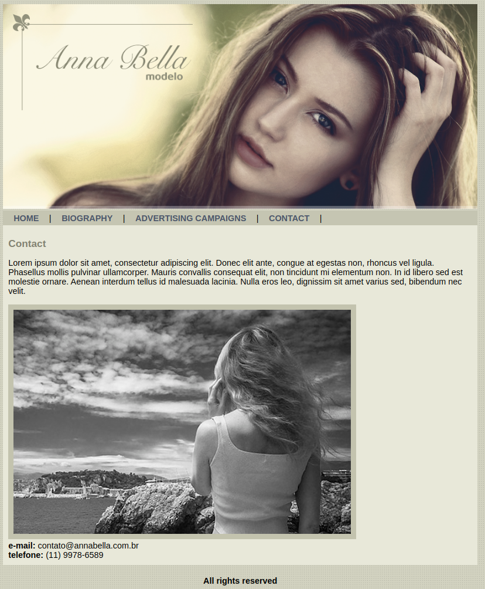

## Projeto
### Descrição 
Criando um site para uma modelo fictícia chamada Anna Bella utilizando somente HTML5 e CSS3 básicos. Foi uma proposta de projeto[#2] realizada através do curso Desenvolvimento Web completo da Udemy.

Link para visualizar o site: [Clique aqui](https://ideilsoncisne.github.io/ProjectAnnaBella/)

### Tela
